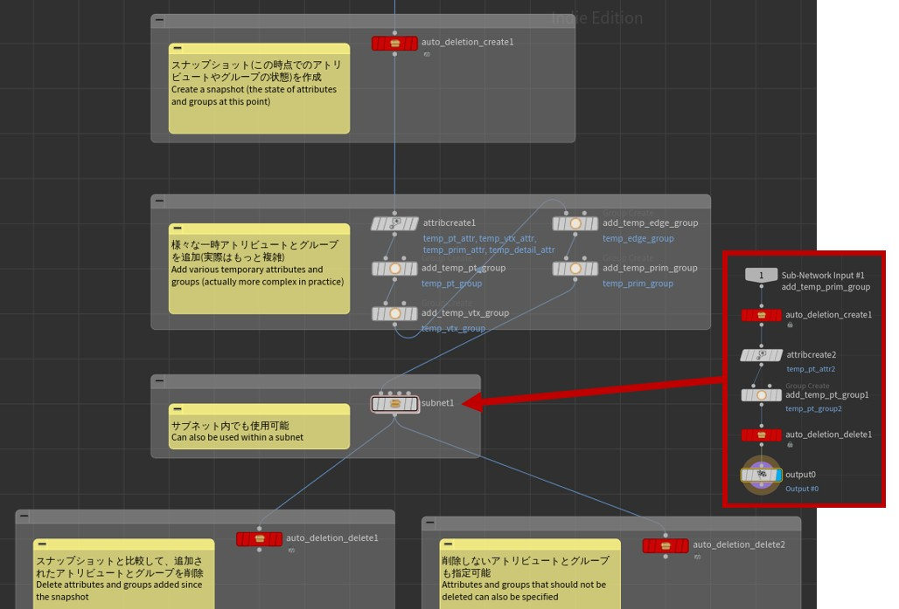

# [Houdini] Auto Deletion HDA
一時的なアトリビュートとグループを自動で削除するHDAです。削除忘れを防止するために作成しました。

## 動作確認環境
Houdini Indie Limited-Commercial 21.0.440

## 導入方法
iribo.auto_deletion.1.0.hdalcをインポートしてください。

## 使用方法
sample.hiplcをご参照ください。

## ノード詳細
### Auto Deletion Create
スナップショット(この時点でのアトリビュートやグループの状態)を作成します。

| | | |
| - | - | - |
| Snapshot Name | スナップショット名を設定します。 |

### Auto Deletion Delete
スナップショットと比較して、追加されたアトリビュートとグループを削除します。
| | | |
| - | - | - |
| Snapshot Name | 比較するスナップショット名を設定します。 |
| Link to Create Node | このノードのSnapshot Nameを、選択したCreateノードのものと紐づけます。 |
| Attr | | |
| Delete (Pt / Vtx / Prim / Detail) Attrs | アトリビュートを削除するかを設定します。 |
| (Pt / Vtx / Prim / Detail) Attr Names Preserve | 削除しないアトリビュート名を設定します。 |
| Group | | |
| Delete (Pt / Vtx / Edge / Prim) Groups | グループを削除するかを設定します。 |
| (Pt / Vtx / Edge / Prim) Group Names Preserve | 削除しないグループ名を設定します。 |
